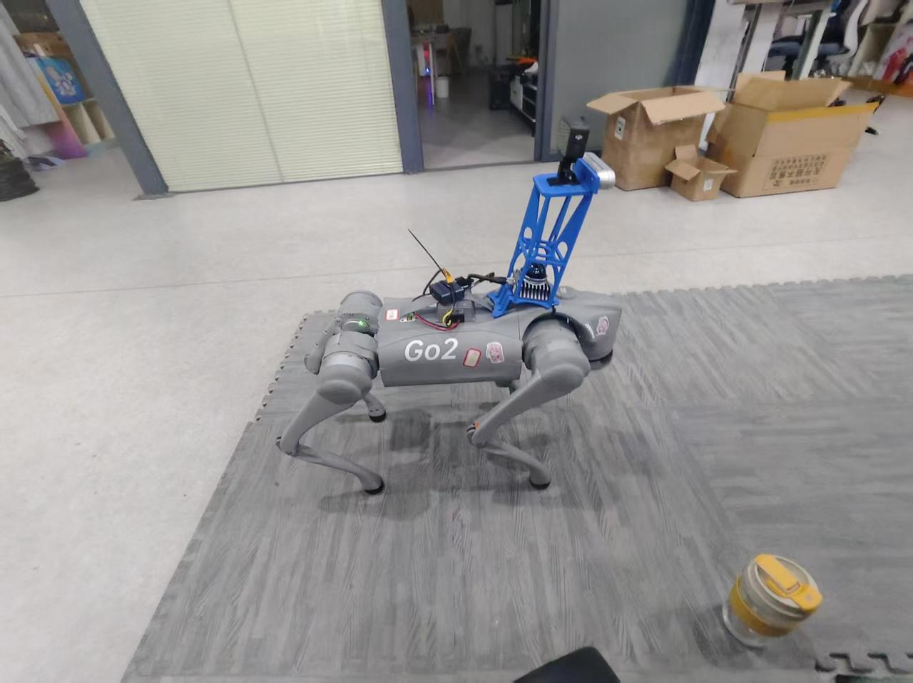

# 1. 项目描述
本项目为宇树机器狗系列第一章ROS2-Gazebo仿真的基础项目仓库，该仓库会随着系列项目的推进不定时进行更新，当前计划可查看本人飞书查看项目情况[项目飞书](https://my.feishu.cn/docx/RsFVdrUeFojrbsxA7AEcTKKenMg)，这个项目预计将会是一个超长期项目。


# 2. 项目使用到的硬件

| 设备             | 数量     | 购买渠道     | 参考价格(元)                               | 备注           |
|------------------|----------|--------------|--------------------------------------------|----------------|
| Unitree Go2      | 1        | 京东、淘宝等 | PRO款：19999（非官方二开）<br>X款：29999（官方二开）<br>EDU款：39999～89999（官方二开） | 必备           |
| 千兆网线         | 保底1根  | 京东、淘宝等 | 24                                         | 推荐首根5米长  |
| Mid 360激光雷达  | 1        | 京东、淘宝等 | 3999                                       | 选配           |
| D455/D435        | 1        | 京东、淘宝等 | D435:2300<br>D455:3600                     | 选配           |
| 30V - 19V降压模块 | 1        | 京东、淘宝等 | 29                                         | 选配           |
| 一分二雷达线     | 1        | 京东、淘宝等 | 85                                         | 选配           |
| 3口千兆交换机    | 1        | 京东、淘宝等 | 48                                         | 选配           |
| 3D打印件         | 3        | 自己、淘宝等 | 20一件                                     | 选配           |

# 3. 项目获取和编译
```bash
git clone https://github.com/yanyuze1/Go2_driver.git    # github获取
git clone https://gitee.com/yanyu-sauce/go2_driver.git  # gitee获取
cd Go2_driver
./build.sh                                              # 编译
```
# 4. 项目使用
```bash
ros2 launch go2_bringup go2_base.launch.py              # 基础
ros2 run teleop_twist_keyboard teleop_twist_keyboard    # cmd_vel控制运动
ros2 launch go2_bringup go2_navigation.launch.py        # 导航
ros2 launch go2_bringup go2_slam.launch.py              # 建图
```
# 5. 项目效果
基础效果


键盘控制效果


建图效果


导航效果


# 6. 更为完整的教程
[Unitree Go2实机部署](https://my.feishu.cn/docx/RsFVdrUeFojrbsxA7AEcTKKenMg)中可获取到更多教程。